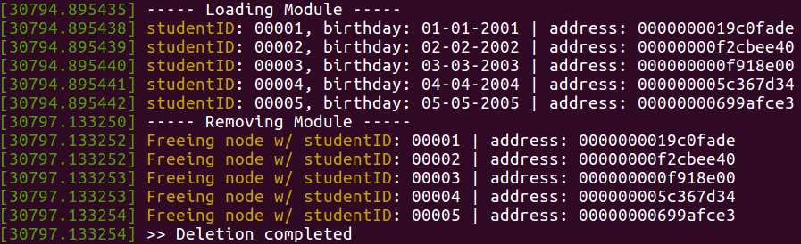

# Operating Systems 2019 Spring - HW1 Report
StudentID: 1062022S <br>
Name: 廖以諾

## Objectives
Construct a Linux kernel linked list which contains nodes recording student ID and birthday. When the kernel is initiated, the linked list with five student nodes is created. The student ID, birthday, and the memory address of each node are printed on the kernel log buffer. When the kernel is terminated, the linked list is removed and its memory space is released back to the system to prevent a memory leak.

The assignment can be divided into the following tasks:

1. Kernel Initiation and Termintation
2. Definition of Student Node
3. Linux Kernel Linked List
4. Final Results

## 1. Kernel Initiation and Termination
To initiate and terminate kernel, we need ```module_init()``` and ```module_exit()``` API. Therefore, we have to include the related libraries as shown below:

```c
#include <linux/init.h>
#include <linux/kernel.h>
#include <linux/module.h>
```

Then, we create ```sample_init()``` and ```sample_exit()``` functions to accomplish our tasks during kernel initiation and termination, respectively. Note that the return value of sample_init() has to be 0 for a successful kernel loading.

```c
// load kernel module
int sample_init(void) {
    printk(KERN_INFO "----- Loading Module -----\n");
    // tasks to be done here ...
    retturn 0;
}

// remove kernel module
void sample_exit(void) {
    printk(KERN_INFO "----- Removing Module -----\n");
    // tasks to be done here ...
    return;
}

// macros for registering module entry and exit points
module_init(sample_init);
module_exit(sample_exit);
```

Note: To print information to kernel, use ```printk(KERN_INFO "info here\n");```

## 2. Definition of Student Node
Before constructing the linked list structure, we have to define the required data for each node. As described by the assignment, student ID and birthday are the data carried by each node. Hence, we build the student node using ```struct```. **Furthermore, besides the data, we have to declare the list node in order for connecting nodes.** Hence, we declare ```struct list_head list;``` in each node.

```c
// variables
#define maxStrLength 10

// linked list node
struct student {
    char studentID[maxStrLength];
    char day[maxStrLength];
    char month[maxStrLength];
    char year[maxStrLength];
    struct list_head list;
};
```

Note: 

- Remember to include list.h library by ```#include <linux/list.h>```.
- maxStrLength is the maximum string length.

## 3. Linux Kernel Linked List
### 3.1. Append student node to the tail of linked list
First of all, we need to specify how data can be written to a student node by ```addStudent()``` function. As shown below, studentID, day, month, and year are the inputs of the function. ```addStudent()``` returns type of student structure as specified in the previous section. Before assigning the values, we have to check if the memory is correctly allocated and if the input string length is valid. If not, we return ```NULL``` to announce adding student node fails. If valid, we assign values and return the student node.

```c
struct student* addStudent(char *studentID, char *day, char *month, char *year) {
    struct student *node = kmalloc(sizeof(struct student), GFP_KERNEL);

    // check memory allocation
    if (node == NULL) {
        return NULL;
    }

    // check parameter validity
    if (strlen(studentID) > maxStrLength || strlen(day) > maxStrLength || \
    		strlen(month) > maxStrLength || strlen(year) > maxStrLength) {
        return NULL;
    }

    // write values
    strcpy(node->studentID, studentID);
    strcpy(node->day, day);
    strcpy(node->month, month);
    strcpy(node->year, year);
    
    return node;
}
```

Note:

- To allocate heap memory for kernel, use ```kmalloc()```. Hence, ```#include <linux/slab.h>```.
- The returned value is a pointer in ```struct student``` type as specified in the previous section.

Since now we have built the function for student node construction, the next step is to connect the node to form a linked list. Considering the linked list has to be accessed by both ```sample_init()``` and ```sample_exit()```, we declare ```studentList``` as a global variable. Then, exploit ```list_add_tail()``` to append the node at the tail of the list if a node is successfully constructed.

```c
// global variable
static LIST_HEAD(studentList);

// load kernel module
int sample_init(void) {
    printk(KERN_INFO "----- Loading Module -----\n");

    // INIT_LIST_HEAD(&studentList);
    struct student *node = NULL;

    // adding student nodes
    node = addStudent("00001", "01", "01", "2001");
    if (node == NULL) {
        printk(KERN_INFO ">> adding node failed\n");
    } else {
        list_add_tail(&node->list, &studentList);
    }
    
    // and so on ...
    
    return 0;
}
```

Note:

- ```if (node == NULL) { ... }``` is required to make sure a node is constructed. We do not want to add erroneous node to our linked list.
- The example code only shows one node for simplicity. Adding other nodes applies the same logic. Please check sample.c for details.

### 3.2. Traverse the student linked list
To traverse the linked list, exploit the ```list_for_each_entry()``` function. The first input is a node in type of ```struct student```, the second input is ```studentList```, and the third argument is the ```list``` specified in ```struct student```. While we traverse the linked list, print the studentID, birthday, and the node's memory address to the kernel log buffer.

```c
// traverse student linked list
list_for_each_entry(node, &studentList, list) {
	printk(KERN_INFO "studentID: %s, birthday: %s-%s-%s | address: %p\n", \
			node->studentID, node->day, node->month, node->year, node);
}
```
<br><br>
### 3.3. Delete student node from the head of linked list
To delete the linked list from head to tail, use ```list_for_each_entry_safe()``` and ```list_del()```. The first and second arguments are nodes in type of ```struct student```. We name the first node by ```node``` and the second node by ```next```. In ```list_for_each_entry_safe()```, ```node``` is to be deleted and ```next``` is the temporary storage of the next node of ```node```. In this way, when we use ```list_del()``` to delete ```node``` from the list, the list does not lose the position of the next node. Remember to release the memory allocated during the node initialization by ```kfree()```. During deletion, print the information of the deleted node, including studentID and its memory address, to the kernel log buffer.

```c
// delete student nodes from head
list_for_each_entry_safe(node, next, &studentList, list) {
    printk(KERN_INFO "Freeing node w/ studentID: %s | address: %p\n", \
    		node->studentID, node);
    list_del(&node->list);
    kfree(node);
}
```

To confirm if the deletion is complete, check if ```studentList``` is empty using ```list_empty()```.

```c
// check deletion correctness
if (list_empty(&studentList)) {
    printk(KERN_INFO ">> Deletion completed\n");
} else {
    printk(KERN_INFO ">> Incomplete delection\n");
}
```

Note:

- To release heap memory, we have to use ```kfree()```. Hence, ```#include <linux/slab.h>```.
- Since ```studentList``` is a global variable, ```sample_exit``` can directly access it. 

<br><br><br><br><br><br><br>
## 4. Final Results


To check the kernel log buffer, enter ```$ dmesg``` and the messages are shown in terminal. The result is shown in the following figure. While initiating the kernel module, a student linked list is constructed. Student ID, birthday, and even each node's memory address are shown in the kernel log buffer. The reason for showing the memory address is to confirm that the node deletion is correct. We can compare the node's address during creation and deletion and find that the same address is referred. Besides the memory address, the list after deletion is checked to see if it is actually empty. Since the kernel log prompts **"Deletion completed"**, we are sure the list contains empty node. Now, we are confident that the deletion action is flawless.

