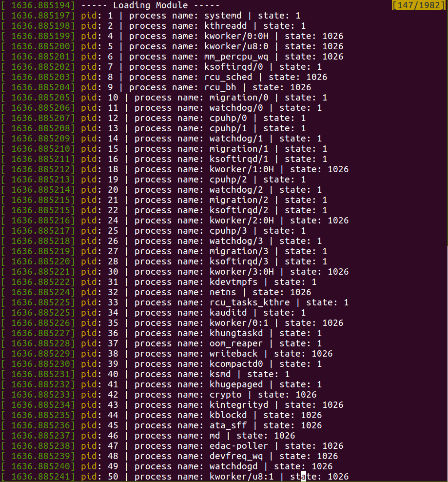
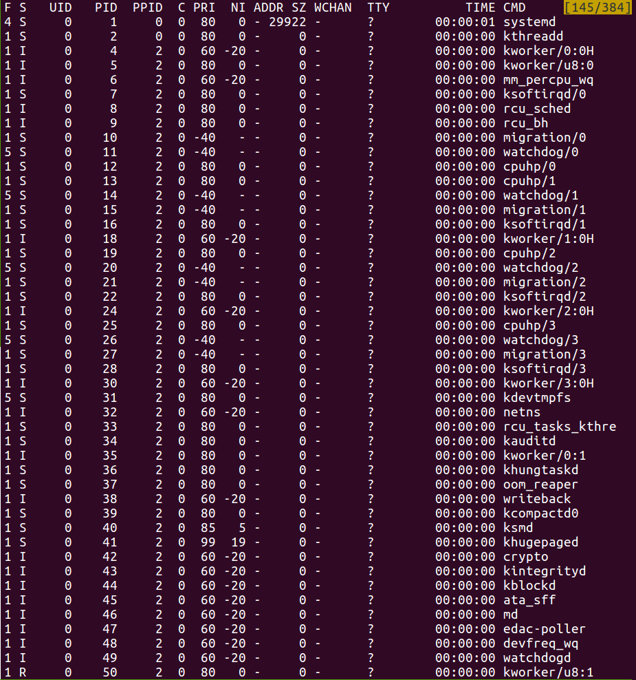
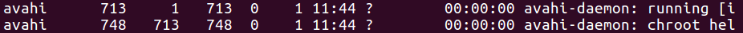
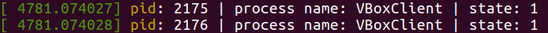
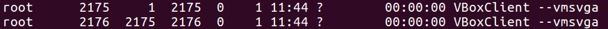

# Operating Systems 2019 Spring - HW2 Report
StudentID: 1062022S <br>
Name: 廖以諾

## Objectives
Design kernel modules that traverse all tasks in the Linux system. Firstly, traverse system tasks in a linear manner and the expected list of tasks are ordered by pid. In addition, design the DFS algorithm to traverse system tasks in a parent-children manner and the expected list of tasks are ordered according to the relationship of inheritance.

There are two missions in the assignment:

1. Iterate Tasks Linearly
2. Iterate Tasks in the DFS Manner

## 1. Iterate Tasks Linearly
### 1.1 Initiate and Terminate the Kernel
To initiate and terminate kernel, we need ```module_init()``` and ```module_exit()``` API. Therefore, we have to include the related libraries as shown below:

```c
#include <linux/init.h>
#include <linux/kernel.h>
#include <linux/module.h>
```

Then, we create ```task_iterator_init()``` and ```task_iterator_exit()``` functions to accomplish our tasks during kernel initiation and termination, respectively. Please check code for details.

### 1.2 Iterate Tasks Linearly
To iterate kernel tasks linearly, we can use ```for_each_process()``` function defined in ```<linux/sched/signal.h>```. ```for_each_process()``` will iterate over all tasks and its input is in the type of ```struct task_struct```. The only thing we have to do is print out the pid, process name, and state while traversing.

Before jump into using ```for_each_process()```, we have to understand how ```struct task_struct``` looks like and how we retrieve the tasks' pid, process name, and state. Check ```sched.h``` carefully, we understand that to get pid, process name, and state, we call task->pid, task->comm, and task->state, respectively. To use ```task_struct```, remember to include ```<linux/sched/signal.h>```.

``` c
#include <linux/sched/signal.h>
```

Now that we know how to retrieve information from ```task_struct```, we call ```for_each_process()``` and print the information to the kernel log while iterating as shown in the following code.

```c
// load kernel module
int task_iterator_init(void) {
    printk(KERN_INFO "----- Loading Module -----\n");

    // iterate tasks linearly
    struct task_struct *task;
    for_each_process(task) {
        printk(KERN_INFO "pid: %d | process name: %s | state: %d\n", \
               task->pid, task->comm, task->state);
    }

    return 0;
}
```

### 1.3 Final Results
To check results, we initiate/terminate the kernel module and check kernel log:

- ```sudo insmod hw2_linear.ko```
- ```sudo rmmod hw2_linear.ko```
- ```dmesg```

<br><br><br><br><br><br><br><br><br><br><br>

The kernel log (partial) is shown as:


<br><br><br><br><br><br>

To verify our result, use ```ps -el``` to compare. The ```ps -el``` result (partial) is shown as:


If we check the pid and process name carefully, we find that our kernel module correctly iterates over all tasks, proving that our program functions properly.

<br><br><br><br><br><br>

## 2. Iterate Tasks in the DFS Manner
### 2.1 Depth-First Search
DFS is a simple and powerful algorithm. To traverse all tasks in the DFS manner, we can follow the below pseudo code. Hence, our task is, in fact, to figure out how to access the children list and apply the DFS function.

```c
// pseudo code of depth-first search
void dfs(task) {
    
    // manipulation for current task
    ...

    // visit neighbors of current task
    for(all neighbors of current task) {
        // dfs
        dfs(neighbor);
    }
    
    return;
}
```

### 2.2 Linux Task's Children Structure
A task's ```children``` and ```sibling``` are defined by ```list_head``` type as shown in ```<linux/sched.h>```. ```children``` is the root of the task's children list and ```sibling``` is the entry of the children list. We can imagine that ```children``` is the pointer pointing to the location of children list from parent and ```sibling``` is the list that contains all current level children.

Now that we understand the children list is implemented by ```list_head```, it is intuitive that we can exploit ```list_for_each()``` to traverse all children of the current task. We get each child one-by-one and pass to ```dfs(child)``` recursively. To get the child, we also need the help of ```list_entry()``` function. It is defined as:

```c
/**
 * list_entry - get the struct for this entry
 * @ptr:	the &struct list_head pointer.
 * @type:	the type of the struct this is embedded in.
 * @member:	the name of the list_head within the struct.
 */
#define list_entry(ptr, type, member) \
    container_of(ptr, type, member)
```

Note: reference of traversing children list of ```task_struct``` is available here <a href="https://stackoverflow.com/questions/34704761/why-sibling-list-is-used-to-get-the-task-struct-while-fetching-the-children-of-a" target="_blank"> here.</a>

### 2.3 Traverse Tasks in DFS
Finally, we use the DFS algorithm explained in section 2.1 along with the understanding of how we access a task's children to reach the final code.

```c
// dfs
void dfs(struct task_struct *task) {
    struct list_head *list;
    struct task_struct *child;
    
    // manipulation for current task: print task
    printk(KERN_INFO "pid: %d | process name: %s | state: %d\n", \
           task->pid, task->comm, task->state);

    // visit children of current task
    list_for_each(list, &task->children) {
        child = list_entry(list, struct task_struct, sibling);

        // dfs
        dfs(child);
    }

    return;
}
```

Notes:

- Current task uses ```&task->children``` to point the root of children list

<br><br><br><br>

### 2.4 Final Results
Since the traversal is in the DFS manner, we expect to see processes being printed in the manner of the parent, children, grandchildren, and so on. As shown in ```ps -eLf``` result, we see that **pid_748** is a child of **pid_713**. We can also see that our kernel module prints **pid_713** first and then **pid_748** right after **pid_713**. This proves that our DFS traversal algorithm is correct.

- partial log from implemeneted kernel

	

- partial log from ```ps -eLf``` (columns: UID | PID | PPID | ... | TIME | CMD)

	
	
Let's take a look at another similar example as shown in the following two figures. From ```ps -eLf```, **pid_2176** is a child of **pid_2175**. Our kernel module prints **pid_2175** first and then **pid_2176** right after **pid_2175**. This, again, proves that our DFS traversal algorithm is correct.

- partial log from implemeneted kernel

	

- partial log from ```ps -eLf``` (columns: UID | PID | PPID | ... | TIME | CMD)

	