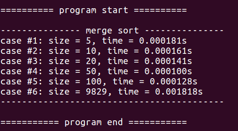

# Operating Systems 2019 Spring - HW3 Report
StudentID: 1062022S <br>
Name: 廖以諾

## Objectives
Exploit Pthread to implement multithreading program on merge sort. The main thread creates additional two threads which are responsible for sorting half of the array. After sorting is completed, main thread will merge two sorted arrays. 

- Note that file arrangement is neglected in the report. Please refer to source code, hw3.c, for details.

## 1. Merge Sort Implemenetation
### 1.1 mergeSort() Function
Merge sort is a recusive sorting algorithm. The numbers array is divided recursively into two parts. Those two parts are then merged in the last step of mergeSort() function. Hence, the time complexity will be O(nlogn). The program of mergeSort() is shown below. The merge() function will be explained in section 1.2.

```c
// merge sort - serial
void mergeSort(int nums[], int start, int end) {
    if (start >= end) {
        return;
    }

    // divide
    int mid = start + (end - start) / 2;
    mergeSort(nums, start, mid);
    mergeSort(nums, mid + 1, end);

    // conquer
    merge(nums, start, mid, end);

    return;
}
```

<br>

### 1.2 merge() Function
The concept of merge() function is simple. Given two sorted arrays, specified by their "start" and end "index", merge() function will merge them into one sorted array. We can divide the merge process into three steps:

1. Create "left" and "right" arrays by copying from the original array "nums"
2. Merge "left" and "right" arrays to "nums"
3. Copy the rest numbers of "left" or "right" array to "nums"

```c
// merge - serial
void merge(int nums[], int start, int mid, int end) {

    // copy to temporary arrays
    int sizeL = mid - start + 1;
    int sizeR = end - (mid + 1) + 1;
    int left[sizeL], right[sizeR];
    for (int i = 0; i < sizeL; i++) {
        left[i] = nums[start + i];
    }
    for (int i = 0; i < sizeR; i++) {
        right[i] = nums[mid + 1 + i];
    }

    // merge left and right into nums
    int i = 0, j = 0, count = start;

    // merge
    while (i < sizeL && j < sizeR) {
        if (left[i] < right[j]) {
            nums[count++] = left[i++];
        } else {
            nums[count++] = right[j++];
        }
    }

    // copy the rest
    while (i < sizeL) nums[count++] = left[i++];
    while (j < sizeR) nums[count++] = right[j++];

    return;
}
```

<br><br>

## 2. Multithread Programming by Pthread
Out task is to create two threads that help us do merge sort for left half and right half of the original array. Hence, the main thread will create two threads and have them do their jobs. After the two threads have done merge sort, the main thread adopt merge function to merge two sorted arrays.

First of all, we implement pthread merge sort function called mergeSortThread as shown below.

```c
// merge sort - thread fundtion
void* mergeSortThread(void *arguments) {

    // retrieve arguments
    struct threadData* arg = (struct threadData*) arguments;
    int thread_id = arg->thread_id;
    int row = arg->row;

    // merge sort initialization 
    // ... (omitted) please refer to hw3.c for details

    if (start >= end) {
        return NULL;
    }

    // divide
    int mid = start + (end - start) / 2;
    mergeSort(nums[row], start, mid);
    mergeSort(nums[row], mid + 1, end);

    // conquer
    merge(nums[row], start, mid, end);
    
    return NULL;
}
```

<br><br><br><br><br><br><br><br><br><br>

Then, we have to create threads in main function as shown below. Note that we assign arguments by passing ```threadArray[thread]``` while calling ```pthread_create```.

```c
// thread input datatype
struct threadData {
    int thread_id;
    int row;
};

int main(int argc, char *argv[]) {
	//... (omitted)
	
	// pthread
	struct threadData* threadArray = malloc(MAX_THREAD * sizeof(struct threadData));
	pthread_t threads[MAX_THREAD];
	
	// ... (omitted)
	
	// create threads
	for (int thread = 0; thread < MAX_THREAD; thread++) {
	
	    // thread arguments
	    threadArray[thread].thread_id = thread;
	    threadArray[thread].row = i;
	
	    // merge sort
	    pthread_create(&threads[thread], NULL, mergeSortThread, (void*) &threadArray[thread]);
	}
	
	// ... (omitted)
	return 0;
}
```

<br><br><br><br><br><br><br><br><br><br><br>

After each thread has done, main thread have to join them by ```pthread_join()``` function and apply merge() function to reach the final result.

```c
int main(int argc, char *argv[]) {
	//... (omitted)
	
	// join threads
	for (int thread = 0; thread < MAX_THREAD; thread++) {
	    pthread_join(threads[thread], NULL);
	}
	
	// merge by main thread
	merge(nums[i], 0, (colSize[i] - 1) / 2, colSize[i] - 1);
	
	// ... (omitted)
	return 0;
}
```

Additionally, we report the sorted array to output.txt file. At the same time, we check the correctness of our sorting function.

```c
int main(int argc, char *argv[]) {
	//... (omitted)
	
	for (int j = 0; j < colSize[i]; j++) {
        // check sorting results
        if (j > 0 && nums[i][j - 1] > nums[i][j]) {
            printf("\n>> incorrect sorting @row = %d\n", i);
        }

        fprintf(outputFile, "%d ", nums[i][j]);
    }
    fprintf(outputFile, "\n");
	
	// ... (omitted)
	return 0;
}
```

<br><br><br><br><br><br>

## 3. Results
The multithread merge sort function is correct and the elapsed time is recorded and printed. I additionally add a large test case and the result is also correct. The terminal prompts the execution results as shown below.



As shown from the results, when the data size is small, the execution time is close. If the data size is much larger, we can observe a significant execution time increase as the case #6. In addition, we have to consider the overhead of communications among threads. If the data size is moderate, perhaps using serial programming is better than multithread programming. On the other hand, if the data size is extremely large, using multithread programming can benefit the execution time.