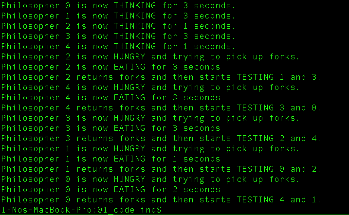
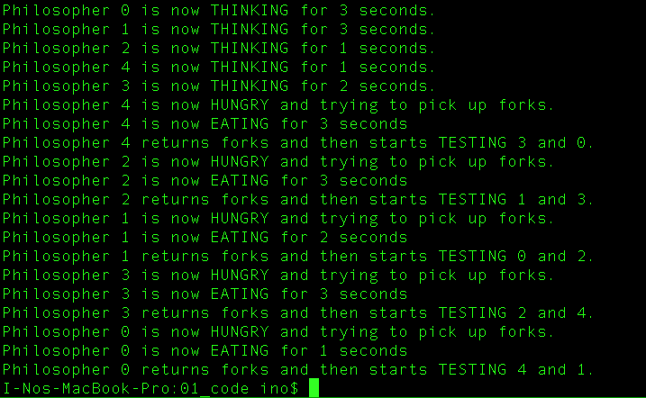

# Operating Systems 2019 Spring - HW4 Report
StudentID: 1062022S <br>
Name: 廖以諾

## Objectives
Implement the famous Dining Philosophers Problem using Pthreads. There are 5 philosophers and 5 forks. All philosophers are initialized to the state of THINKING. The THINKING time is randomly generated from one to three seconds. After THINKING, the state changes to HUNGRY, implying that the philosopher wants to eat. Therefore, the philosopher will try EATING. If the philosopher can acquire left and right forks, she can start EATING. The EATING time is randomly assigned from one to three seconds. Note that the fork is a metaphor of computer resource and left and right forks are available if left and right philosophers are not EATING. After finishing the meal, the philosopher will return the forks and start THINKING again. Right after the philosopher returns the forks, she will test if left and right philosophers would like to eat. Such an action is to wake up others to continue their job when the resource is available. Note that the Dining Philosophers Problem in HW4 only runs for one iteration. In the more realistic demonstration, we will add a while loop to continue running as shown in the below pseudo code.

```c
// multiple iterations version of Dining Philosophers Problem
void* philosopher(int *n) {
    while (1) {
        // 1. THINKING
        // 2. HUNGRY and try EATING
        // 3. reutrn to THINKING
    }
}
```

<br><br><br><br><br><br><br><br><br><br>

## 1. Dining Philosophers Problem
### 1.1 Main Function
The job of the main function is to create multiple threads. Each thread corresponds to a philosopher (a process to be more specific). When all philosophers complete their jobs, the main function will then join back all threads and terminate the program. The example c code is shown as the following.

```c
int main() {

    // variable declaration
    srand((unsigned) time(NULL));
    pthread_t *threads = malloc(N * sizeof(pthread_t));

    // initialization
    for(int i = 0; i < N; i++) {
        state[i] = THINKING;
        pthread_cond_init(&cond_var[i], NULL);
    }
 
    // create thread
    pthread_mutex_init(&mutex, NULL);
    for(int i = 0; i < N; i++) {
        pthread_create(&threads[i], NULL, philospher, &philosophers[i]);
    }

    // join thread
    for(int i = 0; i < N; i++) {
        pthread_join(threads[i], NULL);
    }

    // free
    free(threads);
    pthread_mutex_destroy(&mutex);
}
```

### 1.2 Philosopher Thread Function
The philosophers' action can be summarized in the ```void* philosopher(void *n)``` function. Each philosopher starts from THINKING state. The time of THINKING is randomly assigned from one to three seconds. Then, the philosopher becomes HUNGRY and tries to pick up the forks and start EATING. After the philosopher finishes EATING, she will return the forks and then test if left or right philosophers are waiting for the forks or not. The example c code is shown as the following.

```c
// thread function
void* philospher(void *n) {
    // THINKING
    int thinkingTime = rand() % 3 + 1;
    int *id = n;
    printf("Philosopher %d is now THINKING for %d seconds.\n", *id, thinkingTime);
    sleep(thinkingTime);
    // HUNGRY & try EATING
    pickup_forks(*id);
    // return to THINKING
    return_forks(*id);
    return NULL;
}
```

### 1.3 Test Function (Try to EAT)
In the test function, three conditions have to be fulfilled to allow a philosopher to start EATING.

1. The current philosopher is HUNGRY
2. The philosopher on the left of the current philosopher is not EATING
3. The philosopher on the right of the current philosopher is not EATING

If the above three conditions are fulfilled, we change the current philosopher's state to EATING and she can start EATING for one to three seconds. In addition, after the philosopher finishes her meal, she has to send a signal to broadcast the fact that she has done eating and the forks occupied by her are now available. The signal is implemented by ```pthread_cond_signal()```. If the above three conditions are not all fulfilled, ```test()``` function terminates and the philosopher will have to wait for others to call her to eat when the forks are available. The example c code is shown as the following.

```c
void test(int philosopherId) {
    if (state[philosopherId] == HUNGRY && state[LEFT] != EATING && \
        state[RIGHT] != EATING) {
        int eatingTime = rand() % 3 + 1;
        state[philosopherId] = EATING;
        printf("Philosopher %d is now EATING for %d seconds\n", philosopherId, \
               eatingTime);
        sleep(eatingTime);
        // after EATING finishes, signal to let others know
        pthread_cond_signal(&cond_var[philosopherId]);
    } else if (state[philosopherId] == HUNGRY) {
        printf("Philosopher %d fails to pick up forks and start waiting.\n", \
               philosopherId);
    }
}
```

### 1.4 Pick Up Forks Function
When the philosopher finishes THINKING, she will be hungry and try to eat. Hence, we change her state to HUNGRY. Then, the philosopher tries to eat by calling ```test()``` function. If the state of the philosopher is EATING, it means she successfully acquires the resource and completes EATING so that she can move on to return the forks she possessed. Otherwise, if the state of the philosopher is not EATING, she has to wait for forks. The wait is implemented by ```pthread_cond_wait()```. Note that since only one philosopher, or one thread, is allowed to pick up forks at a time, the pick up forks function is protected by a mutex. The function is locked from the very beginning and unlocked before function returns. The example c code is shown as the following.

```c
void pickup_forks(int philosopherId) {

    // lock
    pthread_mutex_lock(&mutex); 

    // HUNGRY
    state[philosopherId] = HUNGRY;
    printf("Philosopher %d is now HUNGRY and trying to pick up forks.\n", \
           philosopherId);

    // try EATING
    test(philosopherId);

    // wait for forks from left and/or right philosopher
    // namely, wait for signal on cond_var
    if (state[philosopherId] != EATING) {
        pthread_cond_wait(&cond_var[philosopherId], &mutex);
    }

    // unlock
    pthread_mutex_unlock(&mutex);
}
```

### 1.5 Return Forks Function
After the philosopher finished the meal, she should return the forks for others to eat. Then, the state of the philosopher changes back to THINKING. In addition, right after the philosopher restarts THINKING, she will wake the neighboring philosophers by calling ```test(LEFT)``` and ```test(RIGHT)```, where LEFT and RIGHT are defined by (current philosopherId + 4) % N and (current philosopherId + 1) % N, respectively. This is to ensure that all philosophers will complete EATING. Note that since only one philosopher, or one thread, is allowed to return forks at a time, the return forks function is protected by a mutex. The function is locked from the very beginning and unlocked before function returns. The example c code is shown as the following.

```c
void return_forks(int philosopherId) {

    // lock
    pthread_mutex_lock(&mutex);

    // return to THINKING
    state[philosopherId] = THINKING;
    printf("Philosopher %d returns forks and then starts TESTING %d and %d.\n", \
           philosopherId, LEFT, RIGHT);

    // test if left or right philosopher wants to eat
    test(LEFT);
    test(RIGHT);

    // unlock
    pthread_mutex_unlock(&mutex);
}
```

## 2. Results
Two examples are executed to check the correctness of the program. Note that the THINKING and EATING time is randomly assigned using ```rand() % 3 + 1;``` with seed ```srand((unsigned) time(NULL));```.

- Philosophers 0, 1, 2, 3, and 4 think for 3, 3, 1, 3, and 1 seconds. The EATING order is 2, 4, 3, 1, and 0. The order is correct and the results are shown in the following screenshot.

	

<br>

- Philosophers 0, 1, 2, 3, and 4 think for 3, 3, 1, 2, and 1 seconds. The EATING order is 4, 2, 1, 3, and 0. We might wonder what causes the fact that philosopher 1 eats before philosopher 3. According to the THINKING time, philosopher 3 should eat first. However, since each philosopher eats for a time randomly selected from one to three seconds, after she finishes eating, the states of other philosophers might be HUNGRY at the current timestamp. In addition, since philosopher 2 will test philosopher 1 (left) first and then philosopher 3, it is reasonable that philosopher 1 will start EATING before philosopher 3. The results are shown in the following screenshot.

	